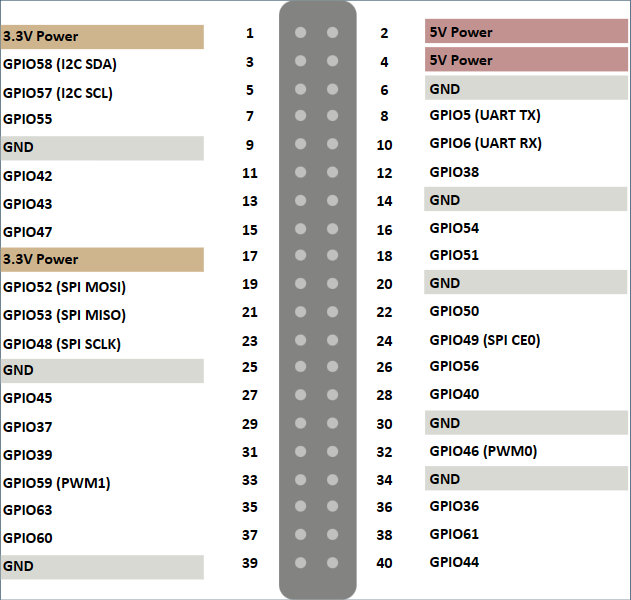

# 昉·星光开发板心率传感器使用

一个简单的 GUI 窗口，通过读取心率传感器的数据来显示心率和血氧。

注意，在实际测量中，结果值会有一定程度的漂移，并且在真实场合使用时还需要连续读取一段时间并使用合适的算法生成合理的结果。

---

## 需要的材料

 - VisionFive 1 开发板
 - OS: openEuler RISC-V
 - 心率传感器 MAX30102
 - 杜邦线

## 前期准备

安装必要的依赖:

```bash
sudo dnf install python python3-tkinter
```

获取 `max30102` 扩展库：

```bash
git clone https://github.com/doug-burrell/max30102.git
cd max30102
```

## 连接线路

我们需要将 `GND` 连接至任意 `GND`（6、9、14、20、25、30、34、39 号都可以），`SCL` 连接至 5 号 `GPIO57 (I2C SCL)`，`SDA` 连接至第 3 号 `GPIO58 (I2C SDA)`，`VIN` 连接至 2 号或 4 号供电口（我们需要 5V 供电）。



## 开始点灯

在 `py-neopixel-spidev` 目录内运行:

```bash
sudo python3 gui_max30102.py
```

## 参考资料

 - [昉·星光系列课程7：昉·星光开发板心率传感器使用](https://forum.rvspace.org/t/topic/2362)
